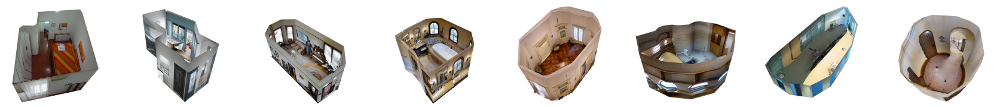
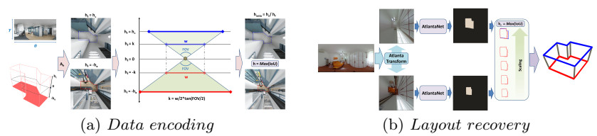

# AtlantaNet
Pytorch implementation of the ECCV 2020 paper: AtlantaNet: Inferring the 3D Indoor Layout from a Single 360 Image beyond the Manhattan World Assumption


Images obtained with resnet101_atlantalayout.pth (see below).

This repo is a **python** implementation where you can try:
- **Inference on panoramic images** to get general shaped room layout (Manhattan or Atlanta World) as .json output (3D model viewing included).
We additionally provide numerical evaluation compared to ground truth (see repository).

3D viewer and evaluation metrics are based on the code provided by HorizonNet(https://github.com/sunset1995/HorizonNet).


**News, 2020-09-15** - Original MatterportLayout annotations, data splitting and pre-trained models provided. Fixed some bugs on reliability check


**Method Pipeline overview**:


## Updates
* 2021-03-1: Minor updates in the documentation
* 2020-09-15:Fixed reliability check bugs in tools.py and inference script
* 2020-09-14: Original MatterportLayout .json annotations fully converted to.txt (HorizonNet format).
	- MatterportLayout .txt annotations with the same corners splitting of the .json format provided(_regular_ in the splitting/ folder).
	- Pre-trained model on the same data provided.
	- Adopted converter json2txt_regular.py
	- NB. previous annotations and models cleaned-up (_origin_).
* 2020-09-2: .txt annotations (HorizonNet format) converted from .json (PanoAnnotator) provided. 
* 2020-09-1: resnet50_matterportlayout_origin.pth updated. Fixed contour approximation issue.
* 2020-08-31: IMPORTANT UPDATE: fixing several issues
	- OpenCV polygonal approximation for .json export
	- Best valid epochs provided (matching with final 3D layout)
	- Data splitting and annotation updated
* 2020-08-26: MatterportLayout pre-trained model trained using the original dataset splitting (including non Atlanta World scenes).
* 2020-08-25: Adopted MatterportLayout data splitting added and related information updated.


## Requirements
- Python 3.6
- pytorch>=1.0.1
- numpy
- scipy
- sklearn
- Pillow
- tqdm
- opencv-python>=4.1.1 (for layout simplification and output exporting)
- open3d>=0.8 (for layout 3D viewer)

## Download Pretrained Models
To be copied in your local ./ckpt directory.
- [resnet50_matterportlayout_regular.pth](https://vicserver.crs4.it/atlantanet/resnet50_matterportlayout_regular.pth)
    - Trained with ResNet50 using MatterportLayout original splitting.  
	    - NB: Includes scenes that do not respect the Atlanta World and Indoor World (single ceiling, vertical walls) hypothesis.
- [resnet50_matterportlayout_iw.pth](https://vicserver.crs4.it/atlantanet/resnet50_matterportlayout_iw.pth)
    - Trained with ResNet50 on MatterportLayout cleaned dataset (splitting/). 
	    - NB: This fitered data, is adopted in the paper to test Atlanta World scenes (see paper Sec.5.1). 
		Refer to this model for Atlanta World performances (without fine tuning).
		Compared to the original version of MatterportLayout is filtered by scenes that do not respect the Indoor World (single ceiling, Manhattan walls) or Atlanta World (single ceiling, vertical walls) hypothesis.
		Furthermore several annotations have been refined to improve thier accuracy (we both provide splitting files and updated annotations to facilitate comparisons).
- [resnet50_atlantalayout.pth](https://vicserver.crs4.it/atlantanet/resnet50_atlantalayout.pth)
    - Trained with ResNet50 on MatterportLayout cleaned dataset (see model above) and finetuned on the AtlantaLayout training set.
- [resnet101_atlantalayout.pth](https://vicserver.crs4.it/atlantanet/resnet101_atlantalayout.pth)
    - Trained with ResNet101 on AtlantaLayout dataset. Provided for ablation study and for qualitative comparison.

It should be noted that results are obtained converting PanoAnnotator (https://github.com/SunDaDenny/PanoAnnotator) annotations, which are general Manhattan World scenes, to Indoor World model scenes (assumption adopted by LayoutNet, DulaNet and HorizonNet - see https://onlinelibrary.wiley.com/doi/abs/10.1111/cgf.14021 for details about such priors).
Converter script is available in the misc folder (misc/json2txt.py).
Due to this conversion and opencv polygonal approximation, numerical performances can slighly differ from those presented in the paper or obtained using a different annotation format.

## Dataset preparation
We follow the same notation (.png image with .txt associated) proposed by HorizonNet (https://github.com/sunset1995/HorizonNet).
Instruction to download and prepare PanoContext/Stanford2D3D, MatterportLayout, Structured3D datasets are provided by HorizonNet (https://github.com/sunset1995/HorizonNet) and MatterportLayout(https://github.com/ericsujw/Matterport3DLayoutAnnotation).

- AtlantaLayout Dataset
    - Download from here: https://vicserver.crs4.it/atlantanet/atlantalayout.zip, the additional Atlanta World cases.
	- Prepare a cleaned version of the MatterportLayout dataset following the split provided in splitting/ folder. Such release is filtered by scenes that do not respect the Indoor World (single ceiling, Manhattan walls) or Atlanta World (single ceiling, vertical walls) hypothesis. Furthermore several annotations have been refined to improve thier accuracy, thus we both provide splitting files and updated annotations.
	- Train the model using the cleaned MatterportLayout dataset (train and validation split).
	- Perform fine tuning using Atlanta World additional cases (train and validation split from zip file above).
	- The adopted testing set is the union on the cleaned MatterportLayout and the new AtlantaLayout testing scenes.
	
## Inference on equirectagular images	
Here an example of inferring using the pre-trained model on MatterportLayout finetuned on AtlantaLayout:
```
python inference_atlanta_net.py --pth ckpt/resnet50_atlantalayout.pth --img data/atlantalayout/test/img/2t7WUuJeko7_c2e11b94c07a4d6c85cc60286f586a02_equi.png
```    
    - `--pth` path to the trained model.
    - `--img` path to the input equirectangular image.
    - `--output_dir` path to the directory to dump .json results (Optional: default = results/).
    - `--visualize` optional for visualizing textured 3D model (Optional: default = True).
	
NB. Since the network output is an image mask and probabilities are not necessary, the final Sigmoid operation is replaced in this script by a simpler threshold operation.

## Acknowledgement
- This work has received funding from Sardinian Regional Authorities under projects VIGECLAB, AMAC, and TDM (POR FESR 2014-2020). We also acknowledge the contribution of the European Union’s H2020 research and innovation programme under grant agreements 813170 (EVOCATION). The provided demo is released to complement the publication under the conditions of the mentioned projects, while the full source code remains the property of CRS4.
- This demo implementation leverages on parts of the HorizonNet code release (https://github.com/sunset1995/HorizonNet) . We thank authors of HorizonNet for their great work and repo.
- Thanks [Yu-hsuan Yeh](https://github.com/Yeh-yu-hsuan) for helping us fixing several issues on this release.


	
## Citation
Please cite our paper for any purpose of usage.
```
@InProceedings{Pintore:2020:AI3,
    author = {Giovanni Pintore and Marco Agus and Enrico Gobbetti},
    title = {{AtlantaNet}: Inferring the {3D} Indoor Layout from a Single 360 Image beyond the {Manhattan} World Assumption},
    booktitle = {Proc. ECCV},
    month = {August},
    year = {2020},
    url = {http://vic.crs4.it/vic/cgi-bin/bib-page.cgi?id='Pintore:2020:AI3'},
}
```


